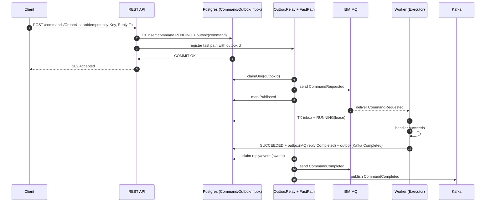
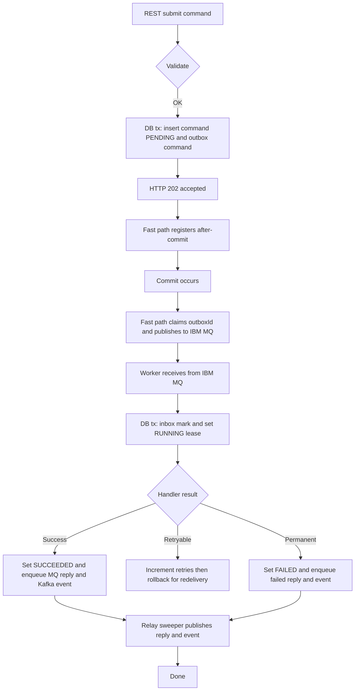

# Reliable Commands & Events Framework — **Single Maven Module** (+ 1 Sample BC)
**Micronaut 4 · Java 17 · IBM MQ (JMS) · Kafka · Postgres · After‑Commit Fast Path**  
Goal: minimal, single-module implementation with one sample bounded context, ≥95% code & branch coverage, and E2E infra assertions (DB row, MQ reply, Kafka event).

> This variant keeps the **Option 1: After‑Commit Fast Path** only (no LISTEN/NOTIFY), to keep latency low without extra moving parts.

---

## 0) Project Layout (single module)

```
reliable-single/
 ├─ pom.xml
 └─ src/
     ├─ main/
     │   ├─ java/com/acme/reliable/...
     │   └─ resources/
     │       ├─ application.yml
     │       └─ db/migration/V1__baseline.sql
     └─ test/
         └─ java/com/acme/reliable/...
```

**Packages**
```
com.acme.reliable.core          // Envelope, errors, CommandBus, Executor, Outbox, Jsons
com.acme.reliable.spi           // Store & transport interfaces
com.acme.reliable.pg            // JDBC Postgres stores
com.acme.reliable.mq            // IBM MQ JMS adapter + consumer
com.acme.reliable.kafka         // Kafka publisher
com.acme.reliable.relay         // OutboxRelay + FastPathPublisher
com.acme.reliable.web           // REST controller
com.acme.reliable.sample        // Sample BC: CreateUser handler
com.acme.reliable.testutil      // Test helpers (E2E assertions)
```

---

## 1) Maven POM (single module with coverage gate)

```xml
<project xmlns="http://maven.apache.org/POM/4.0.0"
         xmlns:xsi="http://www.w3.org/2001/XMLSchema-instance"
         xsi:schemaLocation="http://maven.apache.org/POM/4.0.0 https://maven.apache.org/xsd/maven-4.0.0.xsd">
  <modelVersion>4.0.0</modelVersion>
  <groupId>com.acme</groupId>
  <artifactId>reliable-single</artifactId>
  <version>1.0.0</version>

  <properties>
    <maven.compiler.release>17</maven.compiler.release>
    <micronaut.version>4.3.4</micronaut.version>
    <project.build.sourceEncoding>UTF-8</project.build.sourceEncoding>
  </properties>

  <dependencyManagement>
    <dependencies>
      <dependency>
        <groupId>io.micronaut.platform</groupId>
        <artifactId>micronaut-parent</artifactId>
        <version>${micronaut.version}</version>
        <type>pom</type><scope>import</scope>
      </dependency>
    </dependencies>
  </dependencyManagement>

  <dependencies>
    <!-- Micronaut core -->
    <dependency><groupId>io.micronaut</groupId><artifactId>micronaut-inject</artifactId></dependency>
    <dependency><groupId>io.micronaut</groupId><artifactId>micronaut-http-server-netty</artifactId></dependency>
    <dependency><groupId>io.micronaut</groupId><artifactId>micronaut-runtime</artifactId></dependency>
    <dependency><groupId>io.micronaut.validation</groupId><artifactId>micronaut-validation</artifactId></dependency>

    <!-- Data + Postgres + Flyway -->
    <dependency><groupId>io.micronaut.data</groupId><artifactId>micronaut-data-jdbc</artifactId></dependency>
    <dependency><groupId>org.postgresql</groupId><artifactId>postgresql</artifactId></dependency>
    <dependency><groupId>org.flywaydb</groupId><artifactId>flyway-core</artifactId></dependency>

    <!-- IBM MQ JMS + Micronaut JMS -->
    <dependency><groupId>com.ibm.mq</groupId><artifactId>com.ibm.mq.allclient</artifactId><version>9.3.5.0</version></dependency>
    <dependency><groupId>io.micronaut.jms</groupId><artifactId>micronaut-jms-core</artifactId></dependency>

    <!-- Kafka -->
    <dependency><groupId>io.micronaut.kafka</groupId><artifactId>micronaut-kafka</artifactId></dependency>

    <!-- Jackson -->
    <dependency><groupId>com.fasterxml.jackson.core</groupId><artifactId>jackson-databind</artifactId></dependency>

    <!-- Testing -->
    <dependency><groupId>org.junit.jupiter</groupId><artifactId>junit-jupiter</artifactId><scope>test</scope></dependency>
    <dependency><groupId>org.assertj</groupId><artifactId>assertj-core</artifactId><scope>test</scope></dependency>
    <dependency><groupId>org.testcontainers</groupId><artifactId>junit-jupiter</artifactId><version>1.20.3</version><scope>test</scope></dependency>
    <dependency><groupId>org.testcontainers</groupId><artifactId>postgresql</artifactId><version>1.20.3</version><scope>test</scope></dependency>
    <dependency><groupId>org.testcontainers</groupId><artifactId>kafka</artifactId><version>1.20.3</version><scope>test</scope></dependency>
    <!-- MQ testcontainer image may be private; you can swap for a mock or GenericContainer -->
  </dependencies>

  <build>
    <plugins>
      <plugin>
        <groupId>org.apache.maven.plugins</groupId>
        <artifactId>maven-compiler-plugin</artifactId>
        <version>3.11.0</version>
        <configuration><release>${maven.compiler.release}</release></configuration>
      </plugin>
      <plugin>
        <groupId>org.apache.maven.plugins</groupId>
        <artifactId>maven-surefire-plugin</artifactId>
        <version>3.2.5</version>
        <configuration><useSystemClassLoader>false</useSystemClassLoader></configuration>
      </plugin>
      <plugin>
        <groupId>org.jacoco</groupId>
        <artifactId>jacoco-maven-plugin</artifactId>
        <version>0.8.12</version>
        <executions>
          <execution><goals><goal>prepare-agent</goal></goals></execution>
          <execution><id>report</id><phase>verify</phase><goals><goal>report</goal></goals></execution>
          <execution>
            <id>coverage-check</id>
            <phase>verify</phase>
            <goals><goal>check</goal></goals>
            <configuration>
              <rules>
                <rule>
                  <element>BUNDLE</element>
                  <limits>
                    <limit><counter>INSTRUCTION</counter><value>COVEREDRATIO</value><minimum>0.95</minimum></limit>
                    <limit><counter>BRANCH</counter><value>COVEREDRATIO</value><minimum>0.95</minimum></limit>
                  </limits>
                </rule>
              </rules>
            </configuration>
          </execution>
        </executions>
      </plugin>
    </plugins>
  </build>
</project>
```

---

## 2) Core Code (single module)

### Envelope & Errors
```java
package com.acme.reliable.core;

import java.time.Instant;
import java.util.Map;
import java.util.UUID;

public record Envelope(
    UUID messageId,
    String type, String name,
    UUID commandId, UUID correlationId, UUID causationId,
    Instant occurredAt,
    String key,
    Map<String,String> headers,
    String payload
) {}
```
```java
package com.acme.reliable.core;
public class TransientException extends RuntimeException { public TransientException(String m){ super(m);} }
public class RetryableBusinessException extends RuntimeException { public RetryableBusinessException(String m){ super(m);} }
public class PermanentException extends RuntimeException { public PermanentException(String m){ super(m);} }
```

### SPI
```java
package com.acme.reliable.spi;
import java.time.Instant;
import java.util.*;

public interface CommandStore {
  UUID savePending(String name, String idem, String businessKey, String payload, String replyJson);
  Optional<Record> find(UUID id);
  void markRunning(UUID id, Instant leaseUntil);
  void markSucceeded(UUID id);
  void markFailed(UUID id, String error);
  void bumpRetry(UUID id, String error);
  void markTimedOut(UUID id, String reason);
  boolean existsByIdempotencyKey(String k);
  record Record(UUID id, String name, String key, String payload, String status, String reply) {}
}
public interface InboxStore { boolean markIfAbsent(String messageId, String handler); }
public interface OutboxStore {
  UUID addReturningId(OutboxRow row);
  Optional<OutboxRow> claimOne(UUID id);
  java.util.List<OutboxRow> claim(int max, String claimer);
  void markPublished(UUID id);
  void reschedule(UUID id, long backoffMillis, String error);
  record OutboxRow(UUID id, String category, String topic, String key, String type, String payload, Map<String,String> headers, int attempts){}
}
public interface DlqStore {
  void park(UUID commandId, String commandName, String businessKey, String payload,
            String failedStatus, String errorClass, String errorMessage, int attempts, String parkedBy);
}
public interface CommandQueue { void send(String queue, String body, Map<String,String> headers); }
public interface EventPublisher { void publish(String topic, String key, String value, Map<String,String> headers); }
```

### CommandBus, Executor, Outbox, Jsons
```java
package com.acme.reliable.core;

import com.acme.reliable.spi.CommandStore;
import com.acme.reliable.spi.OutboxStore;
import jakarta.inject.Singleton;
import jakarta.transaction.Transactional;
import java.util.Map;
import java.util.UUID;

@Singleton
public class CommandBus {
  private final CommandStore commands;
  private final OutboxStore outbox;
  private final FastPathPublisher fastPath;

  public CommandBus(CommandStore c, OutboxStore o, FastPathPublisher f){ this.commands=c; this.outbox=o; this.fastPath=f; }

  @Transactional
  public UUID accept(String name, String idem, String bizKey, String payload, Map<String,String> reply){
    if (commands.existsByIdempotencyKey(idem)) throw new IllegalStateException("Duplicate idempotency key");
    UUID id = commands.savePending(name, idem, bizKey, payload, Jsons.toJson(reply));
    UUID outboxId = outbox.addReturningId(Outbox.rowCommandRequested(name, id, bizKey, payload, reply));
    fastPath.registerAfterCommit(outboxId);
    return id;
  }
}
```
```java
package com.acme.reliable.core;

import com.acme.reliable.spi.*;
import jakarta.inject.Singleton;
import jakarta.transaction.Transactional;
import java.time.Instant;

@Singleton
public class Executor {
  private final InboxStore inbox; private final CommandStore commands;
  private final OutboxStore outbox; private final DlqStore dlq;
  private final HandlerRegistry registry; private final long leaseSeconds;

  public Executor(InboxStore i, CommandStore c, OutboxStore o, DlqStore d, HandlerRegistry r, long leaseSeconds){
    inbox=i; commands=c; outbox=o; dlq=d; registry=r; this.leaseSeconds=leaseSeconds;
  }

  @Transactional
  public void process(Envelope env){
    if (!inbox.markIfAbsent(env.messageId().toString(),"CommandExecutor")) return;
    commands.markRunning(env.commandId(), Instant.now().plusSeconds(leaseSeconds));
    try {
      String resultJson = registry.invoke(env.name(), env.payload());
      commands.markSucceeded(env.commandId());
      outbox.addReturningId(Outbox.rowMqReply(env, "CommandCompleted", resultJson));
      outbox.addReturningId(Outbox.rowKafkaEvent("events."+env.name(), env.key(), "CommandCompleted",
                 Aggregates.snapshot(env.key())));
    } catch (PermanentException e) {
      commands.markFailed(env.commandId(), e.getMessage());
      dlq.park(env.commandId(), env.name(), env.key(), env.payload(), "FAILED", "Permanent", e.getMessage(), 0, "worker");
      outbox.addReturningId(Outbox.rowMqReply(env, "CommandFailed", Jsons.of("error", e.getMessage())));
      outbox.addReturningId(Outbox.rowKafkaEvent("events."+env.name(), env.key(), "CommandFailed", Jsons.of("error", e.getMessage())));
      throw e;
    } catch (RetryableBusinessException | TransientException e) {
      commands.bumpRetry(env.commandId(), e.getMessage());
      throw e;
    }
  }

  public interface HandlerRegistry { String invoke(String name, String payload); }
}
```
```java
package com.acme.reliable.core;

import com.acme.reliable.spi.OutboxStore.OutboxRow;
import java.util.Map;
import java.util.UUID;

public final class Outbox {
  public static OutboxRow rowCommandRequested(String name, UUID id, String key, String payload, Map<String,String> reply){
    return new OutboxRow(UUID.randomUUID(), "command", "APP.CMD."+name+".Q", key,
        "CommandRequested", payload, Jsons.merge(reply, Map.of("commandId", id.toString())), 0);
  }
  public static OutboxRow rowKafkaEvent(String topic, String key, String type, String payload){
    return new OutboxRow(UUID.randomUUID(), "event", topic, key, type, payload, Map.of(), 0);
  }
  public static OutboxRow rowMqReply(Envelope env, String type, String payload){
    String replyTo = env.headers().getOrDefault("replyTo", "APP.CMD.REPLY.Q");
    return new OutboxRow(UUID.randomUUID(),"reply", replyTo, env.key(), type, payload,
        Jsons.merge(env.headers(), Map.of("correlationId", env.correlationId().toString())), 0);
  }
}
```
```java
package com.acme.reliable.core;
import com.fasterxml.jackson.databind.ObjectMapper;
import java.util.HashMap;
import java.util.Map;
public final class Jsons {
  private static final ObjectMapper M = new ObjectMapper();
  public static String toJson(Object o){ try { return M.writeValueAsString(o);} catch(Exception e){ throw new RuntimeException(e);}}
  public static String of(String k, String v){ return toJson(Map.of(k,v)); }
  public static Map<String,String> merge(Map<String,String> a, Map<String,String> b){ var m=new HashMap<String,String>(); m.putAll(a); m.putAll(b); return m; }
}
```

---

## 3) Postgres Stores (JDBC) + Flyway

### SQL
```sql
-- src/main/resources/db/migration/V1__baseline.sql
create type command_status as enum ('PENDING','RUNNING','SUCCEEDED','FAILED','TIMED_OUT');

create table command (
  id uuid primary key,
  name text not null,
  business_key text not null,
  payload jsonb not null,
  idempotency_key text not null,
  status command_status not null,
  requested_at timestamptz not null default now(),
  updated_at timestamptz not null default now(),
  retries int not null default 0,
  processing_lease_until timestamptz,
  last_error text,
  reply jsonb not null default '{}'::jsonb,
  unique (name, business_key),
  unique (idempotency_key)
);

create table inbox (
  message_id text not null,
  handler text not null,
  processed_at timestamptz not null default now(),
  primary key (message_id, handler)
);

create table outbox (
  id uuid primary key,
  category text not null,
  topic text not null,
  key text not null,
  type text not null,
  payload jsonb not null,
  headers jsonb not null default '{}'::jsonb,
  status text not null default 'NEW',
  attempts int not null default 0,
  next_at timestamptz,
  claimed_by text,
  created_at timestamptz not null default now(),
  published_at timestamptz,
  last_error text
);
create index outbox_dispatch_idx on outbox (status, coalesce(next_at, 'epoch'::timestamptz), created_at);
```

### JDBC Implementations
```java
package com.acme.reliable.pg;
import com.acme.reliable.spi.CommandStore;
import jakarta.inject.Singleton;
import javax.sql.DataSource;
import java.sql.*;
import java.time.Instant;
import java.util.*;

@Singleton
public class PgCommandStore implements CommandStore {
  private final DataSource ds;
  public PgCommandStore(DataSource ds){ this.ds=ds; }

  @Override
  public UUID savePending(String name, String idem, String key, String payload, String reply){
    try (var c = ds.getConnection()) {
      UUID id = UUID.randomUUID();
      try (var ps = c.prepareStatement(
        "insert into command(id, name, business_key, payload, idempotency_key, status, reply) values (?,?,?,?,?,'PENDING',?)")) {
        ps.setObject(1, id); ps.setString(2, name); ps.setString(3, key); ps.setString(4, payload);
        ps.setString(5, idem); ps.setString(6, reply); ps.executeUpdate();
      }
      return id;
    } catch(SQLException e){ throw new RuntimeException(e); }
  }
  @Override public Optional<Record> find(UUID id){ try(var c=ds.getConnection(); var ps=c.prepareStatement("select id,name,business_key,payload,status,reply from command where id=?")){ ps.setObject(1,id); var rs=ps.executeQuery(); if(rs.next()) return Optional.of(new Record((UUID)rs.getObject(1), rs.getString(2), rs.getString(3), rs.getString(4), rs.getString(5), rs.getString(6))); return Optional.empty(); } catch(SQLException e){ throw new RuntimeException(e);} }
  @Override public void markRunning(UUID id, Instant lease){ exec("update command set status='RUNNING', processing_lease_until=? where id=?", ps->{ ps.setObject(1, lease); ps.setObject(2, id);} ); }
  @Override public void markSucceeded(UUID id){ exec("update command set status='SUCCEEDED', updated_at=now() where id=?", ps->{ ps.setObject(1, id);} ); }
  @Override public void markFailed(UUID id, String err){ exec("update command set status='FAILED', last_error=?, updated_at=now() where id=?", ps->{ ps.setString(1, err); ps.setObject(2, id);} ); }
  @Override public void bumpRetry(UUID id, String err){ exec("update command set retries=retries+1, last_error=?, updated_at=now() where id=?", ps->{ ps.setString(1, err); ps.setObject(2, id);} ); }
  @Override public void markTimedOut(UUID id, String reason){ exec("update command set status='TIMED_OUT', last_error=?, updated_at=now() where id=?", ps->{ ps.setString(1, reason); ps.setObject(2, id);} ); }
  @Override public boolean existsByIdempotencyKey(String k){ return queryOne("select 1 from command where idempotency_key=?", ps->{ ps.setString(1,k);} ).isPresent(); }

  private void exec(String sql, SqlApplier a){ try (var c=ds.getConnection(); var ps=c.prepareStatement(sql)){ a.apply(ps); ps.executeUpdate(); } catch(SQLException e){ throw new RuntimeException(e);} }
  private Optional<Integer> queryOne(String sql, SqlApplier a){ try (var c=ds.getConnection(); var ps=c.prepareStatement(sql)){ a.apply(ps); var rs=ps.executeQuery(); return rs.next()?Optional.of(1):Optional.empty(); } catch(SQLException e){ throw new RuntimeException(e);} }
  interface SqlApplier { void apply(PreparedStatement ps) throws SQLException; }
}
```
```java
package com.acme.reliable.pg;
import com.acme.reliable.spi.InboxStore;
import jakarta.inject.Singleton;
import javax.sql.DataSource;
import java.sql.*;

@Singleton
public class PgInboxStore implements InboxStore {
  private final DataSource ds;
  public PgInboxStore(DataSource ds){ this.ds=ds; }
  @Override public boolean markIfAbsent(String messageId, String handler){
    try (var c=ds.getConnection(); var ps=c.prepareStatement("insert into inbox(message_id, handler) values(?,?) on conflict do nothing")) {
      ps.setString(1,messageId); ps.setString(2,handler);
      return ps.executeUpdate()==1;
    } catch(SQLException e){ throw new RuntimeException(e); }
  }
}
```
```java
package com.acme.reliable.pg;
import com.acme.reliable.spi.OutboxStore;
import jakarta.inject.Singleton;
import javax.sql.DataSource;
import java.sql.*;
import java.util.*;

@Singleton
public class PgOutboxStore implements OutboxStore {
  private final DataSource ds;
  public PgOutboxStore(DataSource ds){ this.ds=ds; }
  @Override public java.util.UUID addReturningId(OutboxRow r){
    try (var c=ds.getConnection()){
      var id = r.id()!=null ? r.id() : java.util.UUID.randomUUID();
      try (var ps=c.prepareStatement("insert into outbox(id,category,topic,key,type,payload,headers,status,attempts) values (?,?,?,?,?,?,?,'NEW',0)")) {
        ps.setObject(1,id); ps.setString(2,r.category()); ps.setString(3,r.topic()); ps.setString(4,r.key());
        ps.setString(5,r.type()); ps.setString(6,r.payload());
        ps.setString(7, com.acme.reliable.core.Jsons.toJson(r.headers()));
        ps.executeUpdate();
      }
      return id;
    } catch(SQLException e){ throw new RuntimeException(e); }
  }
  @Override public Optional<OutboxRow> claimOne(java.util.UUID id){
    try (var c=ds.getConnection()){
      c.setAutoCommit(false);
      try (var ps=c.prepareStatement(
        "update outbox set status='CLAIMED', claimed_by=? where id=? and status='NEW' returning id,category,topic,key,type,payload,headers,attempts")) {
        ps.setString(1, java.net.InetAddress.getLoopbackAddress().getHostName());
        ps.setObject(2, id);
        var rs=ps.executeQuery();
        if (rs.next()) {
          var row = new OutboxRow((java.util.UUID)rs.getObject(1), rs.getString(2), rs.getString(3),
                   rs.getString(4), rs.getString(5), rs.getString(6), java.util.Map.of(), rs.getInt(8));
          c.commit();
          return Optional.of(row);
        }
        c.commit();
        return Optional.empty();
      } catch(Exception ex){ c.rollback(); throw ex; }
    } catch(SQLException e){ throw new RuntimeException(e); }
  }
  @Override public java.util.List<OutboxRow> claim(int max, String claimer){
    try (var c=ds.getConnection()){
      var ps=c.prepareStatement(
        "with c as (select id from outbox where status='NEW' and (next_at is null or next_at<=now()) order by created_at limit ? for update skip locked) update outbox o set status='CLAIMED', claimed_by=?, attempts=o.attempts from c where o.id=c.id returning o.id,o.category,o.topic,o.key,o.type,o.payload,o.headers,o.attempts");
      ps.setInt(1, max); ps.setString(2, claimer);
      var rs=ps.executeQuery(); var out=new ArrayList<OutboxRow>();
      while(rs.next()){
        out.add(new OutboxRow((java.util.UUID)rs.getObject(1), rs.getString(2), rs.getString(3), rs.getString(4),
            rs.getString(5), rs.getString(6), java.util.Map.of(), rs.getInt(8)));
      }
      return out;
    } catch(SQLException e){ throw new RuntimeException(e); }
  }
  @Override public void markPublished(java.util.UUID id){ exec("update outbox set status='PUBLISHED', published_at=now() where id=?", ps->{ ps.setObject(1,id);} ); }
  @Override public void reschedule(java.util.UUID id, long backoffMs, String err){ exec("update outbox set status='NEW', next_at=now()+ (?||' milliseconds')::interval, attempts=attempts+1, last_error=? where id=?", ps->{ ps.setLong(1,backoffMs); ps.setString(2,err); ps.setObject(3,id);} ); }
  private void exec(String sql, PgCommandStore.SqlApplier a){ try (var c=ds.getConnection(); var ps=c.prepareStatement(sql)){ a.apply(ps); ps.executeUpdate(); } catch(SQLException e){ throw new RuntimeException(e);} }
}
```
```java
package com.acme.reliable.pg;
import com.acme.reliable.spi.DlqStore;
import jakarta.inject.Singleton;
import javax.sql.DataSource;

@Singleton
public class PgDlqStore implements DlqStore {
  private final DataSource ds;
  public PgDlqStore(DataSource ds){ this.ds=ds; }
  @Override public void park(java.util.UUID commandId, String commandName, String businessKey, String payload, String failedStatus, String errorClass, String errorMessage, int attempts, String parkedBy){
    try (var c=ds.getConnection(); var ps=c.prepareStatement(
        "insert into command_dlq(command_id, command_name, business_key, payload, failed_status, error_class, error_message, attempts, parked_by) values (?,?,?,?,?,?,?,?,?)")) {
      ps.setObject(1, commandId); ps.setString(2, commandName); ps.setString(3, businessKey); ps.setString(4, payload);
      ps.setString(5, failedStatus); ps.setString(6, errorClass); ps.setString(7, errorMessage);
      ps.setInt(8, attempts); ps.setString(9, parkedBy); ps.executeUpdate();
    } catch(Exception e){ throw new RuntimeException(e); }
  }
}
```

---

## 4) IBM MQ + Kafka Adapters

```java
package com.acme.reliable.mq;
@jakarta.inject.Singleton
public class IbmMqFactoryProvider {
  @jakarta.inject.Named("mqConnectionFactory")
  @jakarta.inject.Singleton
  public jakarta.jms.ConnectionFactory mqConnectionFactory() throws Exception {
    com.ibm.mq.jms.MQConnectionFactory cf = new com.ibm.mq.jms.MQConnectionFactory();
    cf.setTransportType(com.ibm.msg.client.wmq.WMQConstants.WMQ_CM_CLIENT);
    cf.setHostName(System.getenv("MQ_HOST"));
    cf.setPort(Integer.parseInt(System.getenv("MQ_PORT")));
    cf.setQueueManager(System.getenv("MQ_QMGR"));
    cf.setChannel(System.getenv("MQ_CHANNEL"));
    cf.setAppName("reliable-cmd");
    cf.setBooleanProperty(com.ibm.msg.client.wmq.WMQConstants.USER_AUTHENTICATION_MQCSP, true);
    cf.setStringProperty(com.ibm.msg.client.wmq.WMQConstants.USERID, System.getenv("MQ_USER"));
    cf.setStringProperty(com.ibm.msg.client.wmq.WMQConstants.PASSWORD, System.getenv("MQ_PASS"));
    return cf;
  }
}
```
```java
package com.acme.reliable.mq;
@jakarta.inject.Singleton
public class JmsCommandQueue implements com.acme.reliable.spi.CommandQueue {
  private final jakarta.jms.ConnectionFactory cf;
  public JmsCommandQueue(@jakarta.inject.Named("mqConnectionFactory") jakarta.jms.ConnectionFactory cf){ this.cf=cf; }
  @Override public void send(String queue, String body, java.util.Map<String,String> headers){
    try (var conn=cf.createConnection(); var sess=conn.createSession(true, jakarta.jms.Session.SESSION_TRANSACTED)) {
      var dest = sess.createQueue(queue);
      var msg = sess.createTextMessage(body);
      if (headers!=null){
        if (headers.containsKey("correlationId")) msg.setJMSCorrelationID(headers.get("correlationId"));
        if (headers.containsKey("replyTo")) msg.setJMSReplyTo(sess.createQueue(headers.get("replyTo")));
        for (var e: headers.entrySet())
          if (!e.getKey().equals("correlationId") && !e.getKey().equals("replyTo"))
            msg.setStringProperty(e.getKey(), e.getValue());
      }
      sess.createProducer(dest).send(msg); sess.commit();
    } catch(Exception e){ throw new RuntimeException(e); }
  }
}
```
```java
package com.acme.reliable.kafka;
@jakarta.inject.Singleton
public class MnKafkaPublisher implements com.acme.reliable.spi.EventPublisher {
  private final org.apache.kafka.clients.producer.KafkaProducer<String, String> producer;
  public MnKafkaPublisher(org.apache.kafka.clients.producer.KafkaProducer<String, String> p){ this.producer=p; }
  @Override public void publish(String topic, String key, String value, java.util.Map<String,String> headers){
    var rec = new org.apache.kafka.clients.producer.ProducerRecord<String,String>(topic, key, value);
    if (headers!=null) headers.forEach((k,v) -> rec.headers().add(k, v.getBytes()));
    producer.send(rec);
  }
}
```

**JMS consumer → Executor** (wire example):
```java
package com.acme.reliable.mq;
@io.micronaut.jms.annotations.JMSListener(CONNECTION_FACTORY = "mqConnectionFactory", SESSION_TRANSACTED = true)
public class CommandConsumers {
  private final com.acme.reliable.core.Executor exec;
  public CommandConsumers(com.acme.reliable.core.Executor e){ this.exec=e; }

  @io.micronaut.jms.annotations.Queue("APP.CMD.CreateUser.Q")
  public void onCreateUser(javax.jms.Message m) throws javax.jms.JMSException {
    var text = ((javax.jms.TextMessage)m).getText();
    var env = Mappers.toEnvelope(text, m); // TODO: implement helper
    exec.process(env);
  }
}
```

---

## 5) Outbox Relay + Fast Path

```java
package com.acme.reliable.relay;

import com.acme.reliable.spi.OutboxStore;
import com.acme.reliable.spi.CommandQueue;
import com.acme.reliable.spi.EventPublisher;
import jakarta.inject.Singleton;
import java.util.List;
import java.util.UUID;

@Singleton
public class OutboxRelay {
  private final OutboxStore store;
  private final CommandQueue mq;
  private final EventPublisher kafka;
  public OutboxRelay(OutboxStore s, CommandQueue m, EventPublisher k){ store=s; mq=m; kafka=k; }

  public void publishNow(UUID id) {
    store.claimOne(id).ifPresent(this::sendAndMark);
  }

  @io.micronaut.scheduling.annotation.Scheduled(fixedDelay = "30s")
  void sweepOnce() {
    List<OutboxStore.OutboxRow> rows = store.claim(500, host());
    rows.forEach(this::sendAndMark);
  }
  private void sendAndMark(OutboxStore.OutboxRow r) {
    try {
      switch (r.category()) {
        case "command", "reply" -> mq.send(r.topic(), r.payload(), r.headers());
        case "event"            -> kafka.publish(r.topic(), r.key(), r.payload(), r.headers());
        default -> throw new IllegalArgumentException("Unknown category " + r.category());
      }
      store.markPublished(r.id());
    } catch (Exception e) {
      long backoff = Math.min(300_000L, (long)Math.pow(2, Math.max(1, r.attempts()+1))*1000L);
      store.reschedule(r.id(), backoff, e.toString());
    }
  }
  private String host(){ return java.net.InetAddress.getLoopbackAddress().getHostName(); }
}
```
```java
package com.acme.reliable.core;

import com.acme.reliable.relay.OutboxRelay;
import jakarta.inject.Singleton;
import jakarta.transaction.Status;
import jakarta.transaction.Synchronization;
import jakarta.transaction.TransactionSynchronizationRegistry;
import java.util.UUID;

@Singleton
public class FastPathPublisher {
  private final TransactionSynchronizationRegistry tsr;
  private final OutboxRelay relay;
  public FastPathPublisher(TransactionSynchronizationRegistry tsr, OutboxRelay relay){
    this.tsr=tsr; this.relay=relay;
  }
  public void registerAfterCommit(UUID outboxId) {
    tsr.registerInterposedSynchronization(new Synchronization() {
      @Override public void beforeCompletion() { }
      @Override public void afterCompletion(int status) {
        if (status == Status.STATUS_COMMITTED) {
          try { relay.publishNow(outboxId); } catch (Exception ignored) {}
        }
      }
    });
  }
}
```

---

## 6) REST Controller + Config

```java
package com.acme.reliable.web;
@io.micronaut.http.annotation.Controller("/commands")
public class CommandController {
  private final com.acme.reliable.core.CommandBus bus;
  public CommandController(com.acme.reliable.core.CommandBus b){ this.bus=b; }

  @io.micronaut.http.annotation.Post("/{name}")
  public io.micronaut.http.HttpResponse<?> submit(@io.micronaut.http.annotation.PathVariable String name,
                                @io.micronaut.http.annotation.Header("Idempotency-Key") String idem,
                                @io.micronaut.http.annotation.Body String payload,
                                @io.micronaut.http.annotation.Header(value="Reply-To", defaultValue="APP.CMD.REPLY.Q") String replyTo) {
    var cmdId = bus.accept(name, idem, businessKey(payload), payload, java.util.Map.of("mode","mq","replyTo", replyTo));
    return io.micronaut.http.HttpResponse.accepted()
        .header("X-Command-Id", cmdId.toString())
        .header("X-Correlation-Id", cmdId.toString());
  }
  private String businessKey(String payload){ return "key-derive"; }
}
```

`src/main/resources/application.yml` (example minimal)
```yaml
micronaut:
  application:
    name: reliable-single
  server:
    port: 8080
datasources:
  default:
    url: jdbc:postgresql://localhost:5432/reliable
    username: postgres
    password: postgres
    driverClassName: org.postgresql.Driver
jpa:
  default:
    properties:
      hibernate.hbm2ddl.auto: none
flyway:
  datasources:
    default:
      enabled: true
kafka:
  bootstrap:
    servers: localhost:9092
```

---

## 7) Sample Bounded Context

```java
package com.acme.reliable.sample;
@jakarta.inject.Singleton
public class CreateUserHandler implements com.acme.reliable.core.Executor.HandlerRegistry {
  @Override public String invoke(String name, String payload){
    if (!"CreateUser".equals(name)) throw new IllegalArgumentException("Unknown "+name);
    if (payload.contains("\"failPermanent\"")) throw new com.acme.reliable.core.PermanentException("Invariant broken");
    if (payload.contains("\"failTransient\"")) throw new com.acme.reliable.core.TransientException("Downstream timeout");
    return "{\"userId\":\"u-123\"}";
  }
}
```

---

## 8) Testing (≥95% coverage) — Unit + E2E (Testcontainers)

**Unit tests:** core logic (CommandBus, Executor, OutboxRelay backoff + publishNow), stores (CRUD, claim), adapters (headers, correlation).  
**E2E containers:** Postgres, Kafka (or Redpanda), IBM MQ (or mock if container not available).

**E2E happy path:**
- `POST /commands/CreateUser` → DB `PENDING`.
- After‑commit fast path publishes MQ request immediately.
- Worker consumes → DB `SUCCEEDED` → MQ reply `CommandCompleted` → Kafka event `CommandCompleted`.
- Assertions: DB row, MQ reply, Kafka event.

**Negative:** Permanent failure (DLQ+Failed), Transient retries→success.

```java
package com.acme.reliable.testutil;
// helpers for asserting DB rows, MQ messages, Kafka events
public final class Asserts { /* implement browse/selectors/consumers */ }
```

Run: `mvn -q -T 1C clean verify`

---

## 9) Mermaid Diagrams

### Sequence — Happy Path


### Activity — End-to-End (fixed syntax)


---

## 10) Definition of Done
- Single-module build: `mvn clean verify` passes with **≥95%** coverage (JaCoCo gate).  
- E2E proves infra invariants (DB row, MQ reply, Kafka event).  
- Sample BC works end‑to‑end via **after‑commit fast path** only.  
